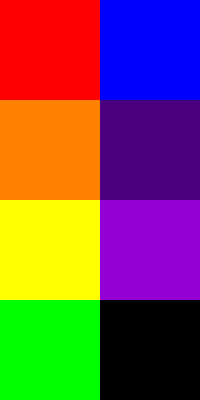
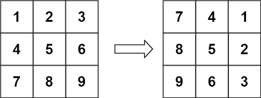
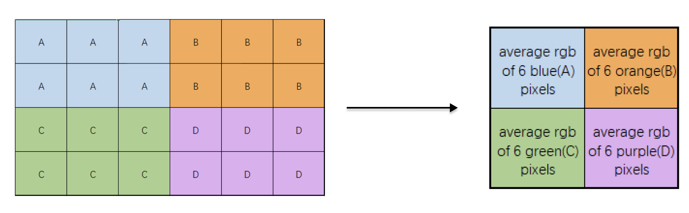
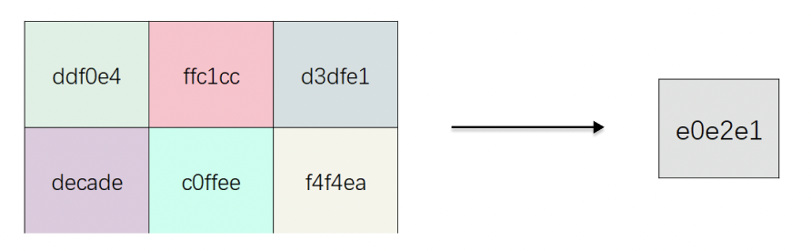
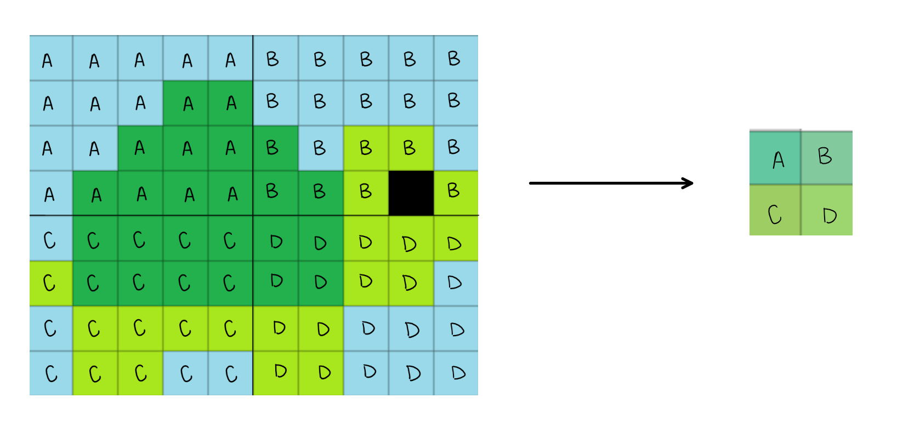
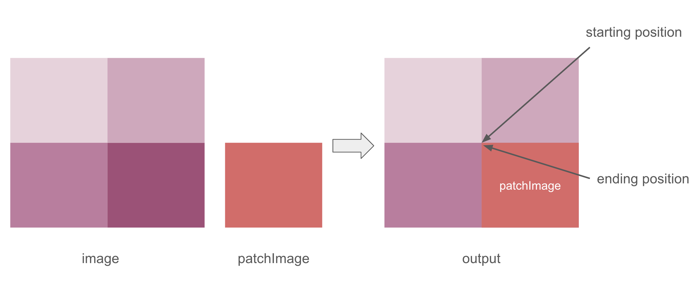
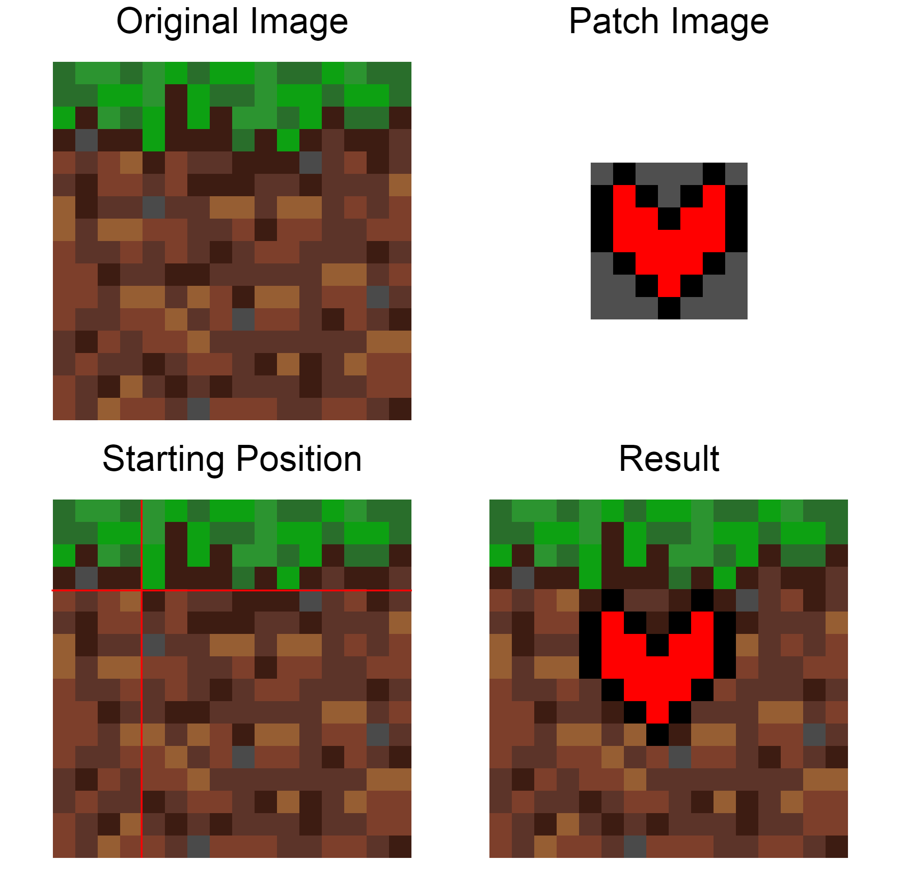

# CSE 11 Spring 2023 PA5 - Image Editor
**Due date: Thursday, May 18 @11:59PM PDT**

There is an [FAQ post](https://piazza.com/class/lfx8rc63u25xd/post/199) on Piazza. Please read that post first if you have any questions.

**Download the starter code from GitHub by clicking: Code $\rightarrow$ Download ZIP**

## Provided Files
- ImageEditor.java
- [Sample Images](https://github.com/CaoAssignments/cse11-sp23-pa5-image-editor-starter#Testing)

## Goal
Programming Assignment 5 is an introduction to two dimensional arrays in Java. You will need to use arrays and many of the other programming techniques you learned from previous PAs to complete the assignment.

## Overview

- Image Editor [Gradescope, 100 points]
    - Implementation [95 points]
    - Style [5 points]

## Image Editor [100 points]
In this programming assignment, we will implement a simple image editor that allows users to edit an image by rotating, lowering resolution, and also patching a smaller image onto it


### Hexadecimal Numbers
**Hexadecimal**, often referred to as **hex**, is a **base-16 numbering system**, using 16 digits to represent numbers. It includes the digits 0-9 and the letters A-F, where A represents 10, B represents 11, and so on up to F representing 15. In programming, we use notations involving a prefix `0x` followed by the hex digits, like `0xAD5E`. Hexadecimal is commonly used in computing and digital systems because it provides a concise and human-readable representation of binary data.

In the context of image pixels, each pixel represents a tiny dot on a digital image. Images are made up of a grid of pixels, and each pixel is assigned a specific color. The color of a pixel is typically represented using a combination of three primary colors: red, green, and blue (RGB). Each primary color component is assigned a value ranging from 0 to 255, indicating the intensity of that color. To represent these color values in a concise and compact manner, hexadecimal notation is used. In hexadecimal, two digits can represent values from 0 to 255, making it an ideal choice for representing pixel color values.

For example, if a pixel has an RGB value of (255, 127, 0) in decimal notation, each of these values can be represented using two hexadecimal digits. In hex, this color would be represented as (FF, 7F, 00), where FF represents 255, 7F represents 127, and 00 represents 0. Sometimes you may also see hex colors represented as #FF7F00. 


### Image
To represent our image, we will be utilizing a 2D int array, where each int represents the RGB color value of a pixel. The number of rows represents the height of the image, and the number of columns represents the width of the image. *You may safely assume each row contains the same number of columns (the image is rectangular). You may also assume the image height and width are both greater than 0.*
 
For example, to represent the following image:




we can use a 2D array to represent the RGB value in each pixel:
```
// hex values                         decimal values
[ [0xFF0000, 0x0000FF]                [ [16711680,     255]
  [0xFF7F00, 0x4B0082]                  [16744192, 4915330]
  [0xFFFF00, 0x9400D3]                  [16776960, 9699539]
  [0x00FF00, 0x000000] ]                [   65280,       0] ]
```
The 2D array on the right hand side is what the static variable `int[][] image` stores.

Taking one of the hex values as an example (`0x9400D3`), the RGB value can be broken down into three components where the range for each component is 0-255:
- red: 0x94 in hex is equal to 148 in decimal
- green: 0x00 in hex is equal to 0 in decimal
- blue: 0xD3 in hex is equal to 211 in decimal

The decimal value of `0x9400D3` (hexadecimal) is `9699539`.

*Note: the image above is 400x200 instead of 4x2. It is scaled up for better visibility and the actual size of the 2D array will contain 80000 RGB values instead of 8.*

Below are a few helpful links to help you with this assignment.
- [pixspy](https://pixspy.com/) can help you find the RGB value of each pixel in the image.
- [convert](https://www.rapidtables.com/convert/color/rgb-to-hex.html) RGB values to their corresponding hexadecimal representation.

### Static Variables
> **__Warning__**
> 
> *Do NOT modify the variable names of provided static instance variables.*
> *Do NOT add additional imports.*
> *Do NOT add any additional static variables. (Unless they are private static final variables.)*
- `static int[][] image`: a 2D array representing RGB values of the image
    - Note: The image will be of size `M x N` where `M` denotes the number of rows and `N` is the number of columns. `M` and `N` can be of different lengths.

### Methods
#### Provided Methods
There are helper methods are provided to you in the starter code. Please read through them carefully and do not modify any of the provided methods.
- `public static int[][] open(String pathname) throws IOException`
- `public static void load(String pathname) throws IOException`
- `public static void save(String pathname) throws IOException`
- `private static int unpackRedByte(int rgb)`
- `private static int unpackGreenByte(int rgb)`
- `private static int unpackBlueByte(int rgb)`
- `private static int packInt(int red, int green, int blue)`
- `public static void printImage()`


#### Public Methods
**For all methods below, leave the original image unchanged if the input values are invalid. If inputs are valid, then the resulting image should be stored in the static variable `image`.**

- `public static void rotate(int degree)`
    - Rotate the image by `degree` degrees **clockwise**.
    - The input value is invalid if `degree` is less than 0 **or** if `degree` is not evenly divisible by 90.
    - To demonstrate rotating a 2D array 90° clockwise, here is a sample 3×3 2D array:
    
        
        
        Please notice the difference between bold and underlined numbers in the below table. Also, the number **3** in the **calculation** column stands for the **number of rows in old 2D array**
        
        |  **value** | **old index** | **new index** |  **calculation** |
        |:-----------:|:------------:|:-------------:|:------------:|
        |      1      | (<ins>0</ins>, **0**) |   (**0**, 2)  | (0, 3-1-<ins>0</ins>) |
        |      2      | (<ins>0</ins>, **1**) |   (**1**, 2)  | (1, 3-1-<ins>0</ins>) |
        |      3      | (<ins>0</ins>, **2**) |   (**2**, 2)  | (2, 3-1-<ins>0</ins>) |
        |      4      | (<ins>1</ins>, **0**) |   (**0**, 1)  | (0, 3-1-<ins>1</ins>) |
        |      5      | (<ins>1</ins>, **1**) |   (**1**, 1)  | (1, 3-1-<ins>1</ins>) |
        |      6      | (<ins>1</ins>, **2**) |   (**2**, 1)  | (2, 3-1-<ins>1</ins>) |
        |      7      | (<ins>2</ins>, **0**) |   (**0**, 0)  | (0, 3-1-<ins>2</ins>) |
        |      8      | (<ins>2</ins>, **1**) |   (**1**, 0)  | (1, 3-1-<ins>2</ins>) |
        |      9      | (<ins>2</ins>, **2**) |   (**2**, 0)  | (2, 3-1-<ins>2</ins>) |
        
        As seen from the table, the general pattern for a 90°-clockwise rotate is:
        - An original pixel at coordinate `(i, j)` becomes a pixel at coordinate `(j, number_of_row_in_old - 1 - i)`.
        
        By using this formula, you can implement the clockwise 90° rotation. Hint: For clockwise rotation of more than 90°, try to think of how these higher-degree rotations are related to a clockwise 90° rotation.

- `public static void downSample(int heightScale, int widthScale)`
    - `heightScale`: down-scaling factor for the height of the image
    - `widthScale`: down-scaling factor for the width of the image
    -  To downsample your image (lower the resolution of the image):
        1. Scale the image smaller so that the pixels in the `heightScale` x `widthScale`-sized-grids become a single pixel.
        2. Fill in the scaled-down pixel with the average RGB value (i.e. average red, average green, and average blue) of original `heightScale` x `widthScale` rectangular grid.
    - Input values are invalid if `heightScale` **or** `widthScale` is
        - less than 1 or greater than the height or width respectively
        - NOT a multiplication factor of the height or width respectively
            - For example, if there are 8 rows (height is 8) and `heightScale` is 3, 8 is not evenly divisible by 3 so the value of `heightScale` is invalid. The original image should be unchanged.
    - Example: `downSample(2, 3)` on an image of size 4×6
    (These four colors are **just** for the visualization, but not the actual colors of the image)
    
    
        
        
        The two parameters passed in refer to the factors of down-sampling. Here, the vertical pixels are down-sampled by a factor of 2, and the horizontal pixels are down-sampled by a factor of 3. As a result, the resulting image size would be: 
        - Vertical: Original vertical size / Vertical factor = 4/2 = 2.
        - Horizontal: Original horizontal size / Horizontal factor = 6/3 = 2.
        
        The resulting image will be of size 2x2.
        
        Consider the 6 pixels in the blue group (A). To find the down sampled pixel, we **cannot** simply take the average of 6 hex values from these pixels. Instead, to find the average, you should separate **R,G,B** values first. Take the average of the red, average of green, average of blue. Then combine these three values into a single RGB value. **Use our provided methods wisely.**
        
        
        
        Here, to calculate the red **R** for result pixel, perform the calculation:
        1. convert hex to decimal: 
            - 0xdd = 221, 0xff = 255, 0xd3 = 211, etc
        3. find the average in decimal
            - $(221 + 255 + 211 + 222 + 192 + 244) / (2×3) = 224.1\dot{6}$
        5. round down 
            - get 224 in decimal, which is 0xe0 in hexadecimal

        The downsampled values of green **G** and blue **B** can be done similarly. After that, recombine the red, green, blue components into a RGB value for the resulting pixel.
        
        **Note:** If the values are not perfectly divisible, you should round the division results **down** to the closest integer (round down [defintion](https://www.collinsdictionary.com/us/dictionary/english/round-down)). In this **R** calculation, the decimal result is 224.1666..., so we should round down to 224 instead. The corresponding hexadecimal value is 0xe0.
        
    - Another example: `downSample(4, 5)` on an image of size 8×10
      
      Here is an additional example of calling the function on a bigger image and the resulting downsample. To check your understanding of the function, see if you can calculate how each section (A, B, C, D) was downsized.
      
      

      
      In the original image:
      - The light blue pixel's hex value is 0x99D9EA. 
      - The dark green pixel's hex vaule is 0x22B14C. 
      - The light green pixel's hex value is 0xA8E61D. 
      - The black pixel's hex value is 0x000000. 

      In the downsized image:
      - Section A's pixel's hex value is 0x63C7A2
      - Section B's pixel's hex value is 0x82CA9D
      - Section C's pixel's hex value is 0x9DCD63
      - Section D's pixel's hex value is 0x9DD66E
- `public static int patch(int startRow, int startColumn, int[][] 
patchImage, int transparentRed, int transparentGreen, int transparentBlue)`
    - Parameters:
        - `patchImage`: a 2D array representing RGB values of the patch image
        - `transparentRed`, `transparentGreen`, `transparentBlue`: an integer representing the corresponding red, green, and blue component for the transparent RGB color
            - This is useful to remove the background color of an image
    - Implementation:
        - Replace a certain part of `image` with `patchImage`, *starting* from position [`startRow`][`startColumn`].
        - If the pixel's RGB value from `patchImage` matches the transparent RGB color, we do not replace the pixel from `image` with the pixel from `patchImage`.
        - Returns the number of pixels that we have patched.
    - You may assume that `transparentRed`, `transparentGreen`, `transparentBlue` will be an integer between 0-255.
    - Parameters are invalid in the following scenarios:
        - `startRow` or `startColumn` is less than 0 or greater than the height or width respectively
        - The *ending* row or column is greater than the height or width respectively
        - Again, if the input is invalid, do not change the original image. *What should the return value be then?*
    - Example: Suppose we have a 2x2 image and want to patch `patchImage` at (1, 1). The starting position is (1, 1) and the ending position is (1,1). Keep in mind to make sure both the *starting* and the *ending* position are within `image`, otherwise it is invalid.
    
    - Another example:  
    
        - The original image is 16x16. The patch image is 7x7. 
        - The patch image's background color is 0x4F4F4F, or (79, 79, 79).
        - If we call `patch(4, 4, patchImage, 79, 79, 79)`:
            - First, verify that startRow, startColumn, ending row, and ending column are all valid
            - Then, starting at [4][4], replace the original image's pixel with patch image's pixel, as long as the pixel is not (79, 79, 79).
            - The result should be the patch image being added onto the original image without the grey background.

    
### Testing
For this PA, public testers can be found on Gradescope and there will be testers that are hidden that you will not be able to see. It is your responsibility to test your program comprehensively.

Here's an example of how you can test your code.

```java     
public static void main(String[] args) throws IOException {
    load("ucsd.png");
    int[][] patchedImage = open("khosla.png");
    int patchedPixels = patch(50, 100, patchedImage, 255, 255, 255);
    System.out.println(patchedPixels);
    save("ucsd_patch_khosla.png");
}
```

Sample Images Provided:
- Big Image
    - ucsd.png
        - original image
    - khosla.png
        - patch image
    - ucsd_rotate.png
        - `degree` = 90
    - ucsd_downsample.png
        - `heightScale` = 4
        - `widthScale` = 2
    - ucsd_patch_khosla.png
        - we patch khosla onto the ucsd image
        - `startRow` = 50
        - `startColumn` = 100
        - `transparentRed` = 0xFF in hex and 255 in decimal
        - `transparentGreen` = 0xFF in hex and 255 in decimal
        - `transparentBlue` = 0xFF in hex and 255 in decimal
- Small Image
    - sample.png
        - original image
    - redblack.png
        - patch image
    - sample_rotate.png
        - `degree` = 90
    - sample_downsample.png
        - `heightScale` = 2
        - `widthScale` = 4
    - sample_patch_redblack.png
        - we patch redblack onto the sample image
        - `startRow` = 1
        - `startColumn` = 1
        - `transparentRed` = 0xFF in hex and 255 in decimal
        - `transparentGreen` = 0xFF in hex and 255 in decimal
        - `transparentBlue` = 0xFF in hex and 255 in decimal

Note: For the small images, you need to zoom in a lot to view it. You may utilize tools like [pixspy](https://pixspy.com/) to help examine the output. Also, you can print out the RGB values stored in the 2D array to check.


### Style [5 Points]
Coding style is an important part of ensuring readability and maintainability of your code. We will grade your code style in all submitted code files according to the style guidelines. Namely, there are a few things you must have in each file/class/method:

* File header
* Class header
* Method header(s)
* Inline comments
* Proper indentation
* Descriptive variable names
* No magic numbers (Exception: Magic numbers can be used for testing.)
* Reasonably short methods (if you have implemented each method according to the specification in this write-up, you’re fine). This is not enforced as strictly.
* Lines shorter than 80 characters, **including comments**
* Javadoc conventions (`@param`, `@return` tags, `/** comments */`, etc.)

A full style guide can be found [here](https://github.com/CaoAssignments/style-guide/blob/main/README.md) and a sample styled file can be found [here](https://github.com/CaoAssignments/guides/blob/main/resources/SampleFile.java). If you need any clarifications, feel free to ask on Piazza.

## Submission & Grading
Submit the following files to Gradescope by **Thursday, May 18 @ 11:59PM PDT**.

- `ImageEditor.java`


**Important:** Even if your code does not pass all the tests, you will still be able to submit your homework to receive partial points for the tests that you passed. **Make sure your code compiles on Gradescope in order to receive partial credit. The file names need to be correct, otherwise no points will be given for the submission.** 

### How your assignment will be evaluated

* **Correctness** [95 points] You will earn points based on the autograder tests that your code passes. If the autograder tests are not able to run (e.g., your code does not compile or it does not match the specifications in this writeup), you may not earn any credit.
* **Coding Style** [5 points]

Some photos are due to the courtesy of UC San Diego Media Gallery.
